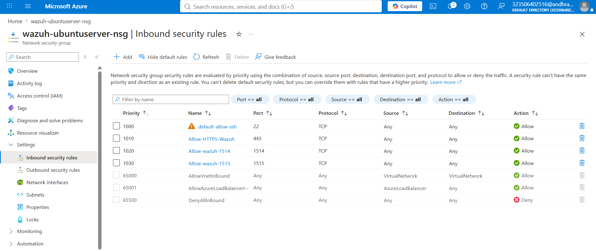
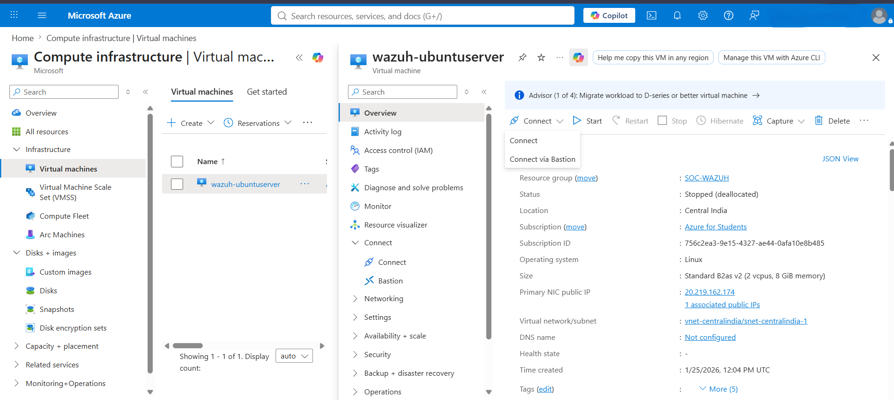

# Cloud-Based Security Operations Center (SOC) Using Wazuh

## Introduction

This project demonstrates how to build a basic **Security Operations Center (SOC)** in the cloud using **Wazuh SIEM** on **Microsoft Azure**. The goal is to collect security logs from multiple systems, monitor suspicious activities, and view everything from a single dashboard.

The setup includes a Wazuh server running on an Ubuntu virtual machine in Azure and multiple monitored endpoints. Linux and Windows machines send their logs to the Wazuh server using Wazuh agents. To improve detection, **File Integrity Monitoring (FIM)** and **VirusTotal integration** are used to identify suspicious or malicious files.

This project provides hands-on experience with cloud deployment, SIEM implementation, endpoint monitoring, and basic threat detection in a practical environment.

---

# Azure Setup

## Overview

Microsoft Azure is used to host the Wazuh server. Instead of running the SIEM on a local machine, the server is deployed on an Azure Virtual Machine, making it accessible from different endpoints over the internet.

The virtual machine hosts the following components:

- Wazuh Manager
- Wazuh Indexer
- Wazuh Dashboard

---

## Azure Resources Used

| Resource | Purpose |
|----------|---------|
| Resource Group | Organizes all project resources |
| Ubuntu Server 22.04 LTS VM | Hosts the Wazuh platform |
| Network Security Group (NSG) | Controls inbound traffic |
| Public IP Address | Allows remote access |
| SSH Key | Secure login to the server |

---

## Network Configuration

The following ports were opened in the Azure Network Security Group:

| Port | Usage |
|------|-------|
| 22 | SSH access |
| 443 | Wazuh Dashboard |
| 1514 | Agent communication |
| 1515 | Agent registration |

  

---

## Implementation

The Ubuntu virtual machine was created in Azure and configured with SSH key authentication for secure access. After deployment, the required firewall rules were added to allow the Wazuh Dashboard and agent communication.

Once the networking was configured, the server was ready for installing and configuring the Wazuh SIEM platform.

  

---

## Result

The Azure environment successfully hosted the Wazuh server and provided a centralized platform for collecting logs, monitoring endpoints, and viewing security alerts through the Wazuh Dashboard.