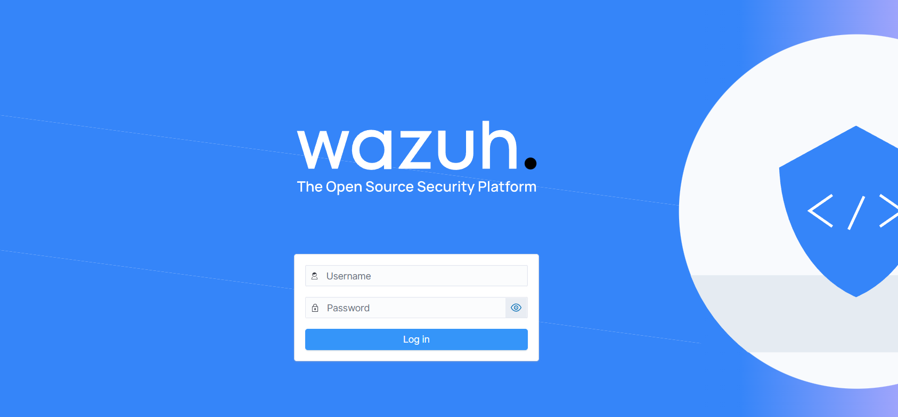
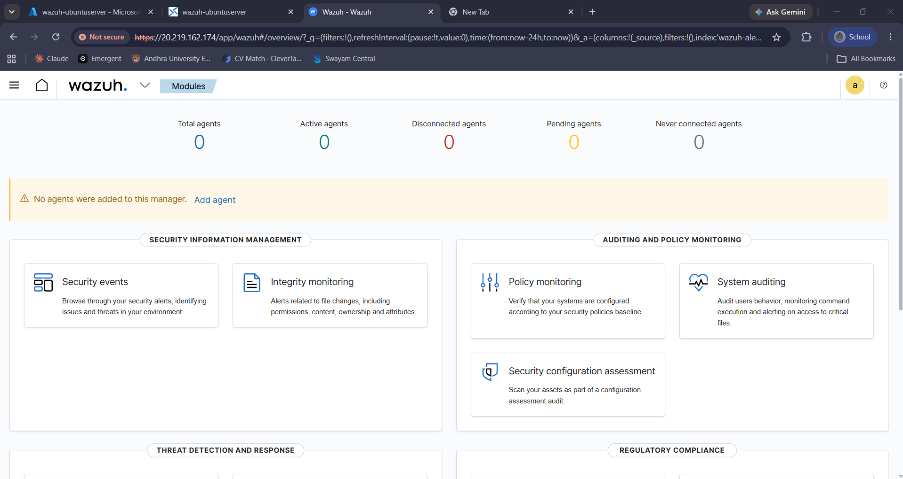

## Overview

After provisioning the Azure Ubuntu Server, the next step was to install the **Wazuh SIEM platform**. The deployment includes all the core services required for centralized security monitoring within a single virtual machine.

The installation consists of:

- Wazuh Manager
- Wazuh Indexer
- Wazuh Dashboard

Running all components on one server keeps the setup simple while providing a complete SIEM environment for learning and testing.

---

## Components

### Wazuh Manager
The Manager acts as the core of the SIEM platform. It receives logs from monitored endpoints, analyzes security events, and generates alerts based on predefined detection rules.

### Wazuh Indexer
The Indexer stores and organizes collected logs, allowing fast searches and efficient retrieval of security events.

### Wazuh Dashboard
The Dashboard provides a web interface to monitor agents, view alerts, search logs, and manage the Wazuh environment from a single location.

---

## Installation Configuration

After installing Wazuh, the following configuration checks were completed:

- Secure communication between all Wazuh components
- HTTPS enabled for Dashboard access
- Verified that all Wazuh services started successfully
- Confirmed dashboard accessibility using the Azure VM public IP

---

## Installation

The Wazuh platform was installed on the Azure Ubuntu Server using the official Wazuh installation assistant. This script installs and configures all the required components, including the Wazuh Manager, Indexer, and Dashboard.

### Update the Server

```bash
sudo apt update && sudo apt upgrade -y
```

### Download the Wazuh Installation Script

```bash
curl -sO https://packages.wazuh.com/4.12/wazuh-install.sh
```

### Make the Script Executable

```bash
chmod +x wazuh-install.sh
```

### Install Wazuh

```bash
sudo ./wazuh-install.sh -a
```

The installation may take several minutes as the script automatically installs and configures all required Wazuh components.

---

## Accessing the Dashboard

Once the installation is complete, open a web browser and navigate to:

```
https://<Azure-Public-IP>
```

Use the administrator credentials generated during installation to log in to the Wazuh Dashboard.

<p align="center">
  
</p>

<p align="center">
<b>Figure 1.</b> Wazuh Dashboard login page.
</p>

---

## Verifying the Installation

After logging in, verify that the Wazuh Dashboard loads successfully and all core services are operational.

The dashboard should initially show zero registered agents until Linux or Windows endpoints are added.

<p align="center">
  
</p>

<p align="center">
<b>Figure 2.</b> Wazuh Dashboard after successful installation.
</p>