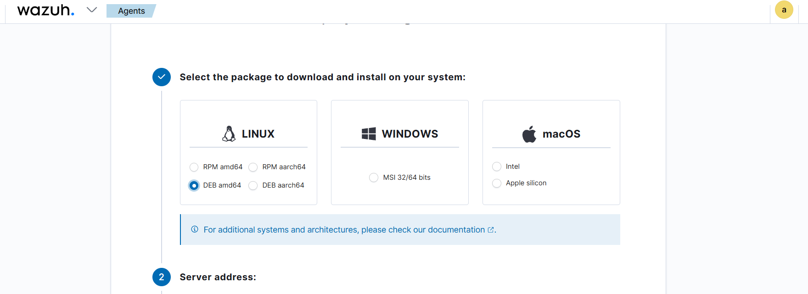
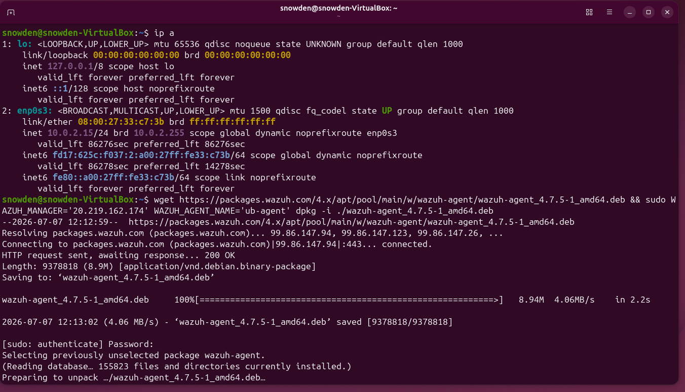
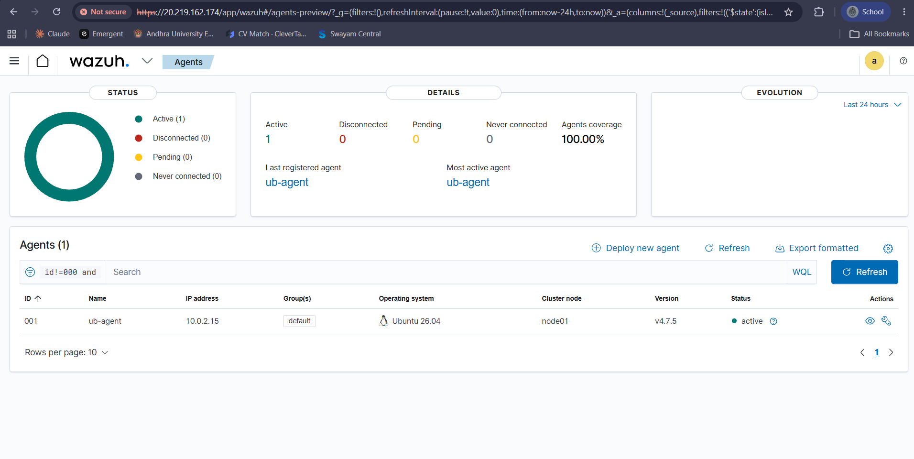

# Ubuntu Agent Setup

## Overview

After deploying the Wazuh server, I connected an Ubuntu Desktop virtual machine as a monitored endpoint. The goal was to install the Wazuh Agent, register it with the Wazuh Manager, and verify that the endpoint was successfully sending security events to the dashboard.

---

## Prerequisites

Before installing the agent, I ensured the following:

- Ubuntu Desktop VM was running.
- The Wazuh Manager was accessible.
- Network connectivity between the endpoint and the Azure VM was available.
- Ports **1514** and **1515** were open for agent communication.

---

## Deploying the Ubuntu Agent

From the Wazuh Dashboard, I navigated to:

```
Agents → Deploy New Agent
```

I selected the following options:

- Operating System: **Linux**
- Package: **DEB (amd64)**
- Server Address: **Azure Wazuh Manager Public IP**
- Agent Name: **ub-agent**
- Group: **default**

The dashboard automatically generated the installation command for the selected configuration.

<p align="center">

</p>

<p align="center">
<b>Figure 1.</b> Configuring the Ubuntu agent from the Wazuh Dashboard.
</p>

---

## Installing the Agent

On the Ubuntu Desktop virtual machine, I executed the generated commands to download and install the Wazuh Agent package.

```bash
wget https://packages.wazuh.com/4.x/apt/pool/main/w/wazuh-agent/wazuh-agent_<version>_amd64.deb

sudo WAZUH_MANAGER="<SERVER_IP>" dpkg -i wazuh-agent_<version>_amd64.deb
```

After installation, I enabled and started the agent service.

```bash
sudo systemctl daemon-reload

sudo systemctl enable wazuh-agent

sudo systemctl start wazuh-agent
```

<p align="center">

</p>

<p align="center">
<b>Figure 2.</b> Installing and starting the Wazuh Agent on Ubuntu.
</p>

---

## Verifying the Connection

Once the agent service started, the endpoint automatically registered with the Wazuh Manager. I verified the deployment by checking the **Agents** section of the Wazuh Dashboard.

The Ubuntu endpoint appeared as an **Active** agent, confirming successful communication with the manager.

<p align="center">

</p>

<p align="center">
<b>Figure 3.</b> Ubuntu agent successfully connected and visible in the Wazuh Dashboard.
</p>

---

## Result

The Ubuntu endpoint was successfully onboarded into the Wazuh environment. From this point onward, the system began forwarding logs and security events to the Wazuh Manager, making it ready for File Integrity Monitoring, log analysis, and threat detection.