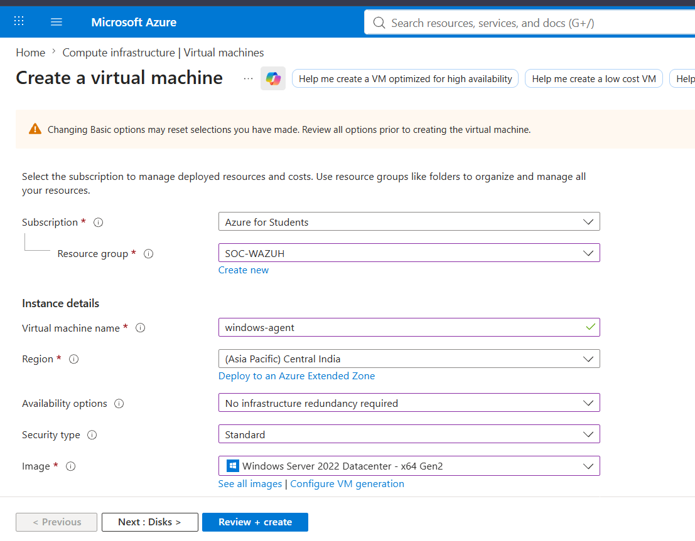
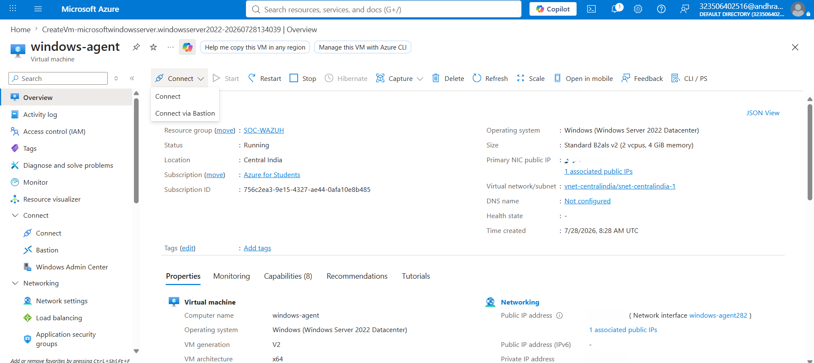
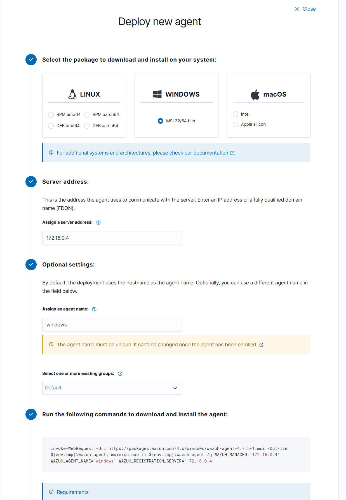
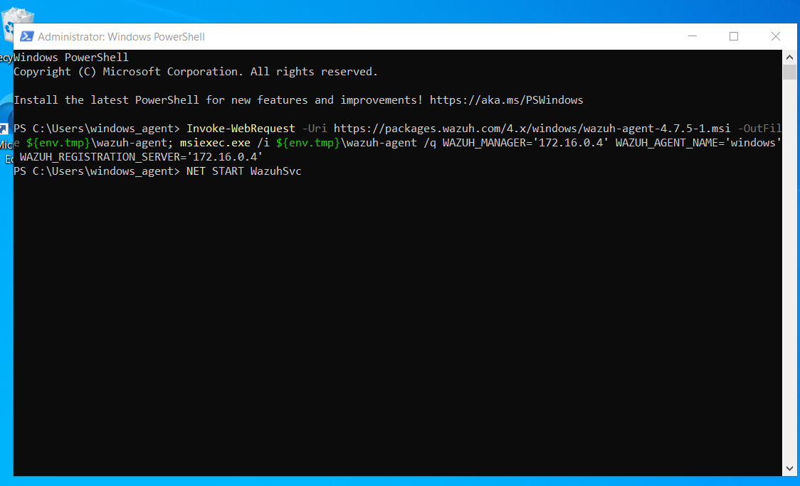
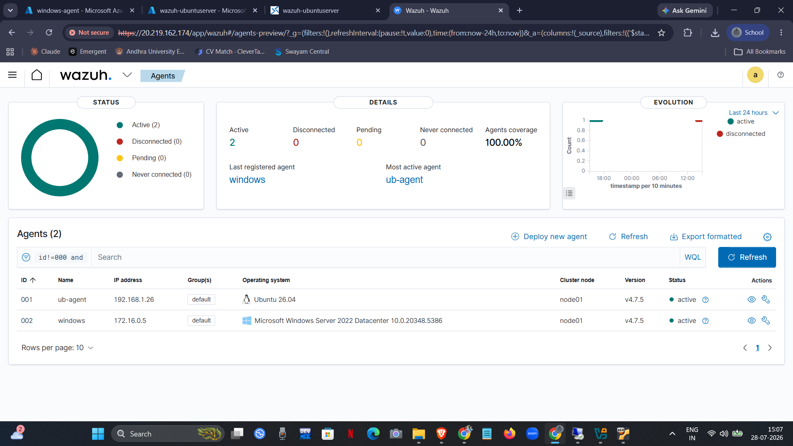

# Windows Agent Setup

## Overview

To extend endpoint visibility in my cloud-based SOC, I deployed a Windows Server 2022 virtual machine in Microsoft Azure and enrolled it into the Wazuh environment. The endpoint was onboarded by installing the Wazuh Agent, allowing it to securely communicate with the Wazuh Manager and forward Windows security events for centralized monitoring.

---

## Prerequisites

Before deploying the agent, I ensured that:

- The Wazuh Manager was already running on the Ubuntu Server.
- A Windows Server 2022 virtual machine was deployed in Azure.
- Network connectivity between the Windows endpoint and the Wazuh Manager was available.
- The required Wazuh communication ports were accessible.

---

## Creating the Windows Endpoint

I first deployed a Windows Server 2022 virtual machine in Microsoft Azure which would act as the monitored Windows endpoint.

<p align="center">

</p>

<p align="center">
<b>Figure 1.</b> Creating the Windows Server virtual machine in Microsoft Azure.
</p>

After deployment, I verified that the virtual machine was running successfully before proceeding with the Wazuh agent installation.

<p align="center">

</p>

<p align="center">
<b>Figure 2.</b> Windows virtual machine successfully deployed and running.
</p>

---

## Deploying the Wazuh Agent

From the Wazuh Dashboard, I navigated to:

```text
Agents → Deploy New Agent
```

I configured the deployment with the following settings:

- Operating System: **Windows**
- Package: **MSI (32/64-bit)**
- Server Address: **Wazuh Manager IP**
- Agent Name: **windows**
- Group: **default**

After entering these details, the dashboard automatically generated the installation command required for the Windows endpoint.

<p align="center">

</p>

<p align="center">
<b>Figure 3.</b> Configuring the Windows agent deployment from the Wazuh Dashboard.
</p>

---

## Installing the Agent

I copied the generated PowerShell command from the dashboard and executed it in an elevated PowerShell window on the Windows virtual machine.

The command downloaded the latest Wazuh Agent installer, configured the manager address, assigned the agent name, and silently installed the agent.

```powershell
Invoke-WebRequest -Uri https://packages.wazuh.com/4.x/windows/wazuh-agent-4.7.5-1.msi -OutFile ${env.tmp}\wazuh-agent

msiexec.exe /i ${env.tmp}\wazuh-agent /q `
WAZUH_MANAGER="<MANAGER_IP>" `
WAZUH_AGENT_NAME="windows" `
WAZUH_REGISTRATION_SERVER="<MANAGER_IP>"
```

After installation, I started the Wazuh Agent service using:

```powershell
NET START WazuhSvc
```

<p align="center">

</p>

<p align="center">
<b>Figure 4.</b> Installing and starting the Wazuh Agent using PowerShell.
</p>

---

## Validation

After the service started successfully, the Windows endpoint automatically registered with the Wazuh Manager.

I verified the deployment from the **Agents** section of the Wazuh Dashboard, where the Windows endpoint appeared as an **Active** agent alongside the Ubuntu endpoint.

<p align="center">

</p>

<p align="center">
<b>Figure 5.</b> Windows endpoint successfully connected to the Wazuh Manager.
</p>

---

## Result

The Windows endpoint was successfully integrated into the Wazuh environment. The Wazuh Agent established secure communication with the manager and began forwarding Windows event logs for centralized monitoring and analysis. This completed the onboarding of the Windows endpoint into the cloud-based SOC.