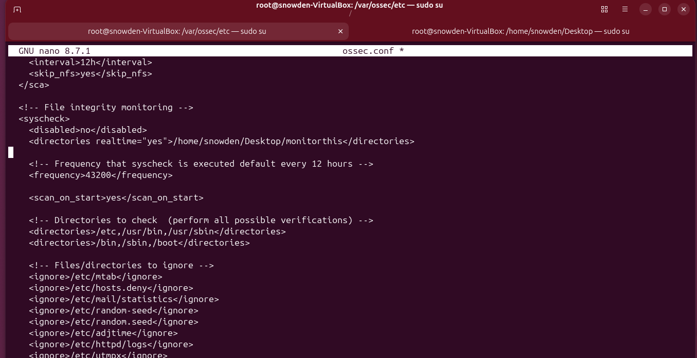
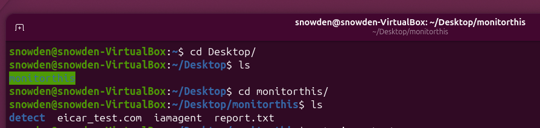
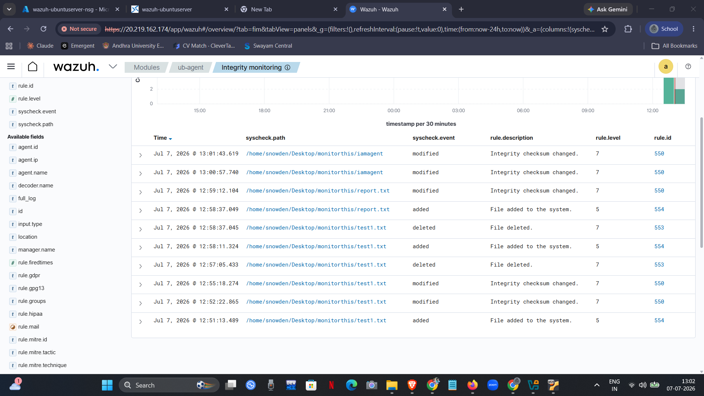
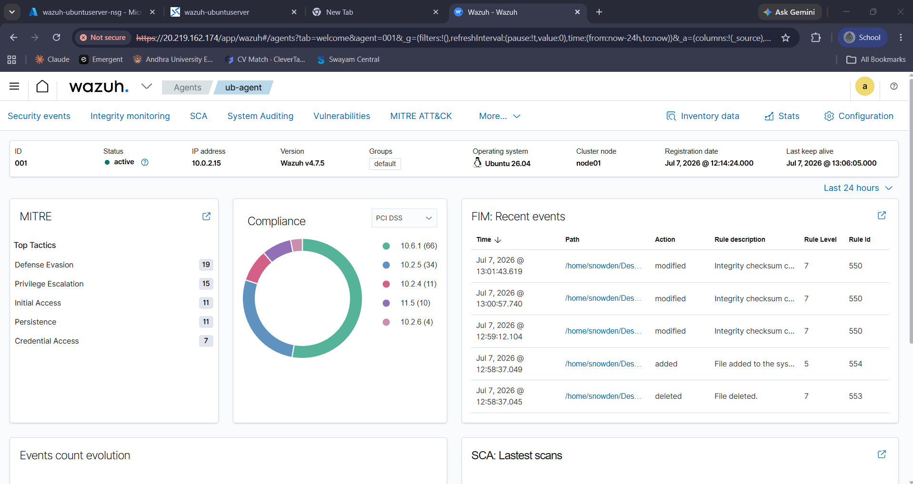
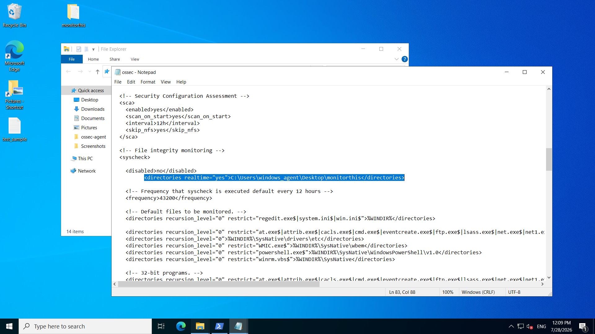
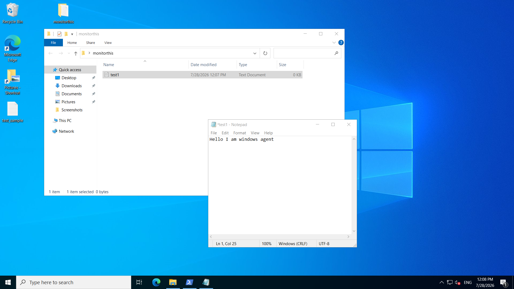
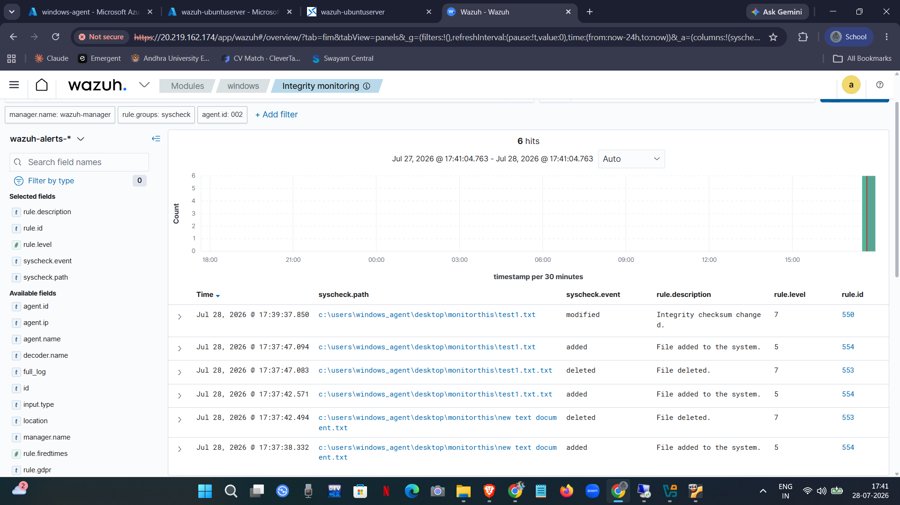

# File Integrity Monitoring (FIM)

## Overview

File Integrity Monitoring (FIM) is one of the core endpoint security capabilities provided by Wazuh. It continuously monitors selected files and directories for unauthorized changes by maintaining a baseline of their integrity attributes. Whenever a monitored file is created, modified, renamed, or deleted, the Wazuh Agent immediately reports the event to the Wazuh Manager, allowing the SOC analyst to investigate suspicious activity in near real time.

In this project, I implemented File Integrity Monitoring on both Ubuntu and Windows endpoints to validate Wazuh's ability to detect file system changes across multiple operating systems.

---

# How File Integrity Monitoring Works

The monitoring workflow follows a simple process:

```
Monitored Directory
        │
        ▼
Wazuh Agent detects file activity
        │
        ▼
Event sent securely to Wazuh Manager
        │
        ▼
Manager processes the event
        │
        ▼
Alert appears in the Wazuh Dashboard
```

The agent continuously watches the configured directory and generates alerts whenever any monitored file operation occurs.

Supported events include:

- File creation
- File modification
- File deletion
- File rename
- Permission changes
- Integrity checksum changes

This enables rapid detection of unauthorized modifications that could indicate malware activity, insider threats, or system compromise.

---

# Ubuntu File Integrity Monitoring

## Objective

For the Linux endpoint, I configured Wazuh to monitor a dedicated directory in real time. The objective was to validate that the agent could successfully detect common file operations and forward them to the centralized SIEM platform.

---

## Monitored Directory

```text
/home/snowden/Desktop/monitorthis
```

This directory was intentionally created for testing file integrity events without affecting system files.

---

## Configuration

To enable real-time monitoring, I updated the Wazuh agent configuration (`ossec.conf`) by adding the target directory inside the **syscheck** module.

```xml
<syscheck>
    <disabled>no</disabled>
    <directories realtime="yes">
        /home/snowden/Desktop/monitorthis
    </directories>
</syscheck>
```

After saving the configuration, I restarted the Wazuh Agent so the new monitoring policy would take effect.

<p align="center">

</p>

<p align="center">
<b>Figure 1.</b> Configuring real-time File Integrity Monitoring on Ubuntu.
</p>

The configuration enables:

- Real-time monitoring
- Continuous integrity verification
- Detection of file creation
- Detection of file modification
- Detection of file deletion
- Detection of rename events

---

## Validation

After enabling FIM, I navigated to the monitored directory and performed several file operations.

```bash
cd ~/Desktop/monitorthis
```

The following activities were tested:

- Creating new files
- Editing file contents
- Renaming files
- Deleting files

<p align="center">

</p>

<p align="center">
<b>Figure 2.</b> Test files created inside the monitored directory.
</p>

---

## Results

Within a few seconds, each operation generated a corresponding File Integrity Monitoring alert inside the Wazuh Dashboard.

The dashboard displayed information including:

- File path
- Event type
- Timestamp
- Rule description
- Rule ID
- Agent name

<p align="center">

</p>

<p align="center">
<b>Figure 3.</b> File Integrity Monitoring events.
</p>

<p align="center">

</p>

<p align="center">
<b>Figure 3.</b> File Integrity Monitoring events displayed in the Dashboard.
</p>
The successful detection of all file operations confirmed that the Linux endpoint was actively monitored in real time.

---

# Windows File Integrity Monitoring

## Objective

To extend endpoint visibility, I configured File Integrity Monitoring on the Windows Server endpoint hosted in Microsoft Azure. The goal was to verify that Windows file system events were also detected and forwarded to the centralized Wazuh Manager.

---

## Monitored Directory

```text
C:\Users\windows_agent\Desktop\monitorthis
```

This directory was selected as an isolated testing location for validating Windows file events.

---

## Configuration

The monitored directory was added to the Windows Wazuh Agent configuration with **real-time monitoring** enabled.

After updating the configuration, I restarted the Wazuh Agent service to apply the new monitoring policy.

<p align="center">

</p>

<p align="center">
<b>Figure 4.</b> Enabling File Integrity Monitoring on the Windows endpoint.
</p>

---

## Validation

To verify the implementation, I performed multiple file operations inside the monitored folder.

The validation included:

- Creating files
- Editing existing files
- Deleting files

<p align="center">

</p>

<p align="center">
<b>Figure 5.</b> File operations performed inside the monitored Windows directory.
</p>

---

## Results

Each operation generated an alert inside the Wazuh Dashboard within seconds.

The generated events included:

| File Operation | Wazuh Detection |
|----------------|-----------------|
| File Creation | File Added |
| File Modification | Integrity Checksum Changed |
| File Deletion | File Deleted |

<p align="center">

</p>

<p align="center">
<b>Figure 6.</b> Windows File Integrity Monitoring alerts displayed in the Wazuh Dashboard.
</p>

The successful detection of every file operation demonstrated that the Windows endpoint was continuously monitored and capable of forwarding real-time integrity events to the centralized SIEM platform.

---

# Comparison

| Feature | Ubuntu | Windows |
|----------|---------|----------|
| Real-time Monitoring | ✅ | ✅ |
| File Creation Detection | ✅ | ✅ |
| File Modification Detection | ✅ | ✅ |
| File Deletion Detection | ✅ | ✅ |
| Rename Detection | ✅ | Supported |
| Dashboard Alerts | ✅ | ✅ |
| Centralized Logging | ✅ | ✅ |

---

# Outcome

By implementing File Integrity Monitoring on both Linux and Windows endpoints, I established continuous visibility into critical file system activities across my cloud-based SOC. Every monitored event was successfully detected by the Wazuh Agent, forwarded to the Wazuh Manager, and visualized through the Wazuh Dashboard.

This implementation demonstrated how Wazuh can provide consistent cross-platform file integrity monitoring, enabling faster detection of unauthorized changes and improving the overall security posture of the environment.