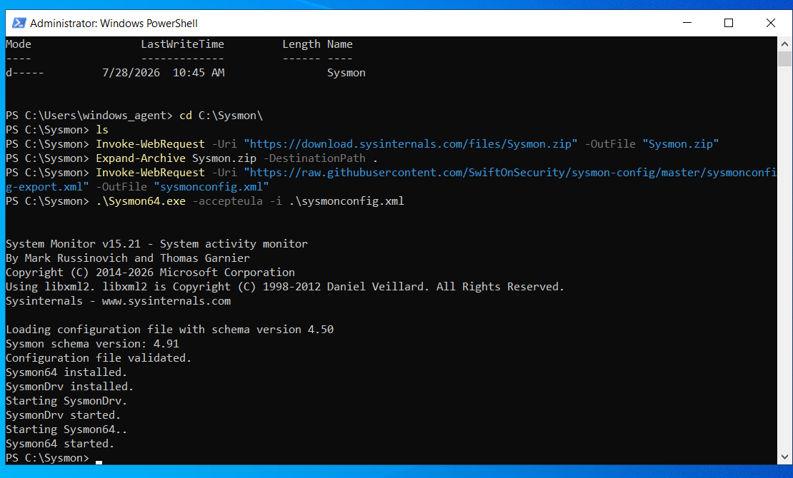
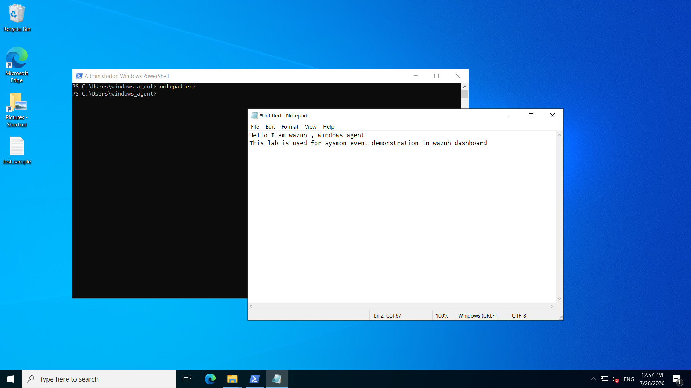
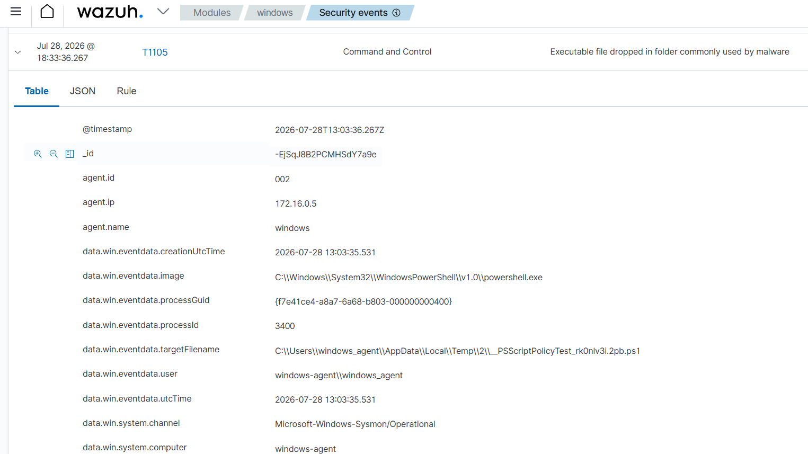

# Microsoft Sysmon Integration

## Overview

Microsoft Sysmon (System Monitor) is an advanced Windows system service developed by Microsoft Sysinternals. It extends the default Windows logging capabilities by generating detailed telemetry about system activities such as process execution, network connections, driver loading, registry modifications, and file creation events.

In this project, I integrated Sysmon with the Wazuh Agent running on a Windows Server 2022 virtual machine hosted in Microsoft Azure. This enabled high-fidelity Windows telemetry to be forwarded to the Wazuh SIEM for centralized monitoring and security analysis.

---

# Why Sysmon?

The default Windows Event Logs provide only limited visibility into endpoint activities. Sysmon enhances this by recording detailed security-relevant events that help detect suspicious behavior during threat investigations.

Some of the important events captured by Sysmon include:

- Process creation
- Network connections
- Driver loading
- Registry modifications
- File creation
- Process termination
- Image loading
- DNS queries (depending on configuration)

By forwarding these events to Wazuh, the SOC gains significantly better visibility into endpoint activities.

---

# How Sysmon Works

The monitoring workflow is illustrated below.

```text
Application / User Activity
            │
            ▼
      Microsoft Sysmon
            │
 Generates detailed event logs
            │
            ▼
 Microsoft-Windows-Sysmon
      Operational Log
            │
            ▼
        Wazuh Agent
            │
            ▼
       Wazuh Manager
            │
            ▼
     Wazuh Dashboard
```

Instead of relying solely on native Windows logs, Sysmon captures detailed endpoint telemetry. The Wazuh Agent monitors the **Microsoft-Windows-Sysmon/Operational** event channel and securely forwards these events to the Wazuh Manager, where they are analyzed and displayed in the dashboard.

---

# Sysmon Installation

To deploy Sysmon on the Windows endpoint, I first downloaded the official Sysmon package from Microsoft Sysinternals. I then extracted the archive and installed Sysmon using the **SwiftOnSecurity Sysmon configuration**, which provides a practical balance between visibility and noise reduction.

The following PowerShell commands were executed:

```powershell
Invoke-WebRequest -Uri "https://download.sysinternals.com/files/Sysmon.zip" -OutFile "Sysmon.zip"

Expand-Archive Sysmon.zip -DestinationPath .

Invoke-WebRequest `
-Uri "https://raw.githubusercontent.com/SwiftOnSecurity/sysmon-config/master/sysmonconfig-export.xml" `
-OutFile "sysmonconfig.xml"

.\Sysmon64.exe -accepteula -i .\sysmonconfig.xml
```

The installation completed successfully, validating the configuration file and starting the Sysmon service.

<p align="center">

</p>

<p align="center">
<b>Figure 1.</b> Installing Microsoft Sysmon using the SwiftOnSecurity configuration.
</p>

---

# Integration with Wazuh

After Sysmon was installed, the Wazuh Agent automatically monitored the following Windows Event Channel:

```text
Microsoft-Windows-Sysmon/Operational
```

Whenever Sysmon generated a security event, the Wazuh Agent collected the event and securely forwarded it to the Wazuh Manager for centralized processing.

This integration significantly improved endpoint visibility by providing detailed process execution information and system telemetry beyond standard Windows Event Logs.

---

# Validation

To verify that Sysmon events were being collected correctly, I generated a simple endpoint activity by launching **Notepad** from an elevated PowerShell session and creating a sample text file.

This produced multiple Sysmon events, including process creation and file activity.

<p align="center">

</p>

<p align="center">
<b>Figure 2.</b> Generating endpoint activity to validate Sysmon event collection.
</p>

---

# Event Collection in Wazuh

After a few seconds, the generated Sysmon events appeared inside the Wazuh Dashboard.

The collected event contained detailed information including:

- Agent name
- Process image
- Process ID
- Process GUID
- User account
- Event timestamp
- Target filename
- Windows event channel

These enriched events provide valuable context for threat hunting and incident response.

<p align="center">

</p>

<p align="center">
<b>Figure 3.</b> Sysmon event successfully collected and displayed in the Wazuh Dashboard.
</p>

The successful appearance of these events confirmed that the Windows endpoint was forwarding Sysmon telemetry correctly to the centralized SIEM platform.

---

# Benefits of Sysmon Integration

Integrating Sysmon with Wazuh provides several security advantages:

- Enhanced Windows endpoint visibility
- Detailed process execution telemetry
- Improved threat detection
- Rich forensic information
- Better incident investigation capabilities
- Centralized event collection within the SIEM platform

---

# Outcome

The integration of Microsoft Sysmon with Wazuh successfully extended the monitoring capabilities of the Windows endpoint beyond the default Windows Event Logs. Security events generated by Sysmon were collected by the Wazuh Agent, forwarded to the Wazuh Manager, and visualized in the Wazuh Dashboard in near real time.

This implementation demonstrated how enriched Windows telemetry can improve endpoint visibility and provide high-quality security data for threat detection, investigation, and incident response within a centralized SOC environment.