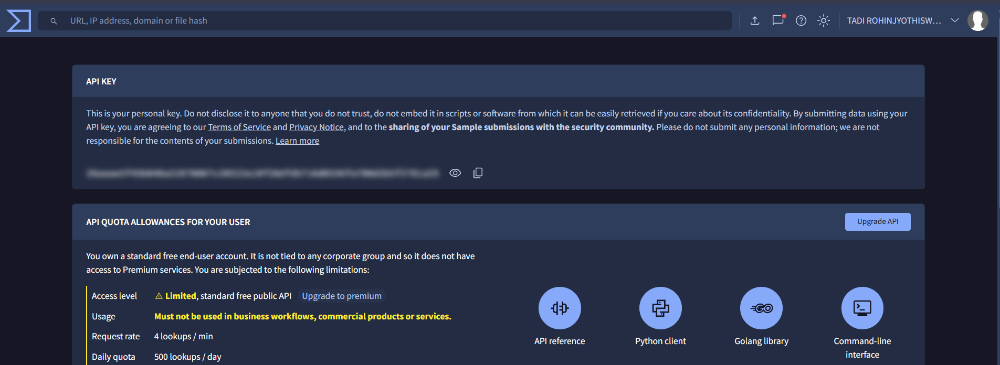
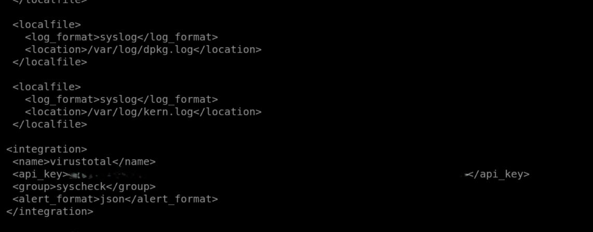
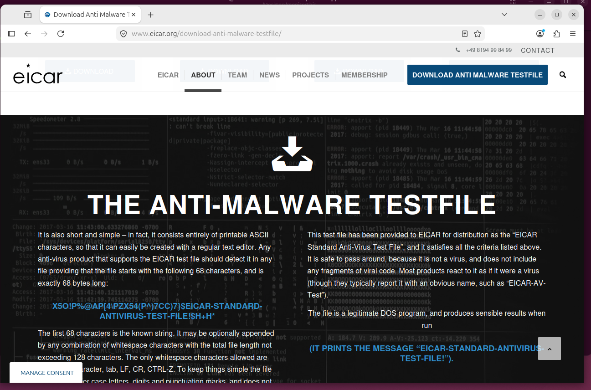
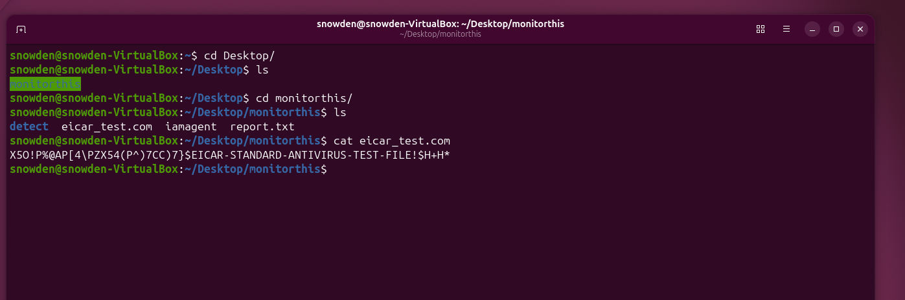
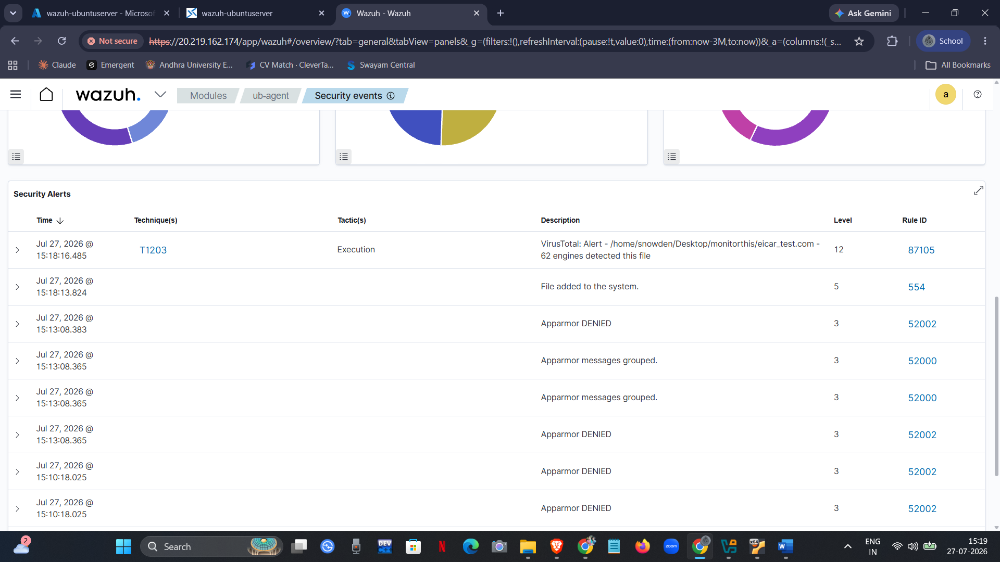

# VirusTotal Integration with Wazuh

## Overview

File Integrity Monitoring (FIM) is excellent at detecting when a file is created, modified, or deleted. However, it cannot determine whether the file itself is malicious.

To overcome this limitation, I integrated **VirusTotal** with my Wazuh SIEM environment. Whenever Wazuh detected a new or modified file through FIM, it automatically calculated the file's **SHA-256 hash** and queried the VirusTotal API. If the hash matched malware already known by VirusTotal, the detection results were added directly to the Wazuh alert.

This integration enriches local endpoint monitoring with cloud-based threat intelligence, allowing suspicious files to be identified more accurately.

---

# Why VirusTotal?

VirusTotal is a cloud-based threat intelligence platform that aggregates results from dozens of antivirus engines and security vendors.

Instead of relying only on local file monitoring, Wazuh can verify whether a detected file has already been classified as malicious by the security community.

### Benefits

- Enriches File Integrity Monitoring alerts
- Identifies known malware automatically
- Provides external threat intelligence
- Reduces manual malware verification
- Improves SOC investigation efficiency

---

# How the Integration Works

The overall workflow is shown below.

```text
          File Created / Modified
                     │
                     ▼
        Wazuh File Integrity Monitoring
                     │
             Generate SHA-256 Hash
                     │
                     ▼
             VirusTotal API Request
                     │
      ┌──────────────┴──────────────┐
      │                             │
      ▼                             ▼
 Known Malicious              Unknown / Clean
      │                             │
      └──────────────┬──────────────┘
                     ▼
           Enriched Wazuh Alert
                     │
                     ▼
            Wazuh Dashboard
```

Whenever a monitored file changes, Wazuh automatically generates its hash and queries the VirusTotal API. The response is then attached to the security alert, providing analysts with immediate threat intelligence without leaving the dashboard.

---

# Configuration

To enable VirusTotal integration, I completed the following configuration steps:

1. Created a VirusTotal account.
2. Generated a personal API key.
3. Added the VirusTotal integration block to the Wazuh Manager configuration (`ossec.conf`).
4. Restarted the Wazuh Manager service to apply the new configuration.

After these steps, Wazuh automatically began querying VirusTotal whenever supported File Integrity Monitoring events were generated.

---

# VirusTotal API Key

The first step was obtaining a personal API key from the VirusTotal portal. This key authenticates requests sent by the Wazuh Manager to the VirusTotal API.

> **Note:** The API key should be treated as confidential and should never be shared publicly or committed to version control.

<p align="center">

</p>

<p align="center">
<b>Figure 1.</b> VirusTotal account showing the generated API key.
</p>

---

# Wazuh Configuration

I configured the VirusTotal integration directly inside the Wazuh Manager configuration file (`ossec.conf`).

The integration block contains:

- Integration name
- VirusTotal API key
- Target event group (`syscheck`)
- Alert format

Example configuration:

```xml
<integration>
    <name>virustotal</name>
    <api_key>YOUR_API_KEY</api_key>
    <group>syscheck</group>
    <alert_format>json</alert_format>
</integration>
```

After saving the configuration, I restarted the Wazuh Manager so the integration could become active.

<p align="center">

</p>

<p align="center">
<b>Figure 2.</b> VirusTotal integration block added to <code>ossec.conf</code>.
</p>

---

# Validation

To verify that the integration was working correctly, I used the **EICAR Anti-Malware Test File**.

The EICAR file is a harmless test file recognized by antivirus products as malware. It allows security solutions to be validated without introducing an actual malicious payload.

I downloaded the EICAR test file and copied it into the directory monitored by Wazuh File Integrity Monitoring.

<p align="center">

</p>

<p align="center">
<b>Figure 3.</b> Downloading the EICAR Anti-Malware Test File.
</p>

---

# Validation Workflow

The following sequence occurred automatically after placing the file inside the monitored directory:

1. Wazuh FIM detected the newly created file.
2. A SHA-256 hash was generated.
3. The hash was submitted to the VirusTotal API.
4. VirusTotal matched the file against its malware database.
5. Wazuh generated an enriched security alert containing the VirusTotal results.

This confirmed that the integration between Wazuh and VirusTotal was functioning as expected.

---

# Generating the Detection

To verify the workflow, I confirmed that the EICAR signature was present in the test file before allowing Wazuh to process it.

<p align="center">

</p>

<p align="center">
<b>Figure 4.</b> Verifying the contents of the EICAR test file inside the monitored directory.
</p>

---

# Detection in Wazuh

Within a few moments, Wazuh generated a security alert enriched with VirusTotal threat intelligence.

The alert contained valuable information including:

- File name
- File path
- SHA-256 hash
- Detection count
- VirusTotal analysis
- Alert severity
- Timestamp
- MITRE ATT&CK mapping

This additional context enables analysts to quickly determine whether a detected file represents a genuine security threat.

<p align="center">

</p>

<p align="center">
<b>Figure 5.</b> VirusTotal-enriched security alert displayed in the Wazuh Dashboard.
</p>

---

# Security Benefits

Integrating VirusTotal with Wazuh provides several advantages:

- Automatic malware reputation checks
- Threat intelligence enrichment
- Reduced manual investigation effort
- Faster identification of known malicious files
- Improved incident response
- Better analyst decision-making
- Centralized visibility inside the SIEM platform

---

# Outcome

The VirusTotal integration successfully enhanced my Wazuh deployment by combining local file integrity monitoring with cloud-based malware intelligence. Instead of reporting only file system changes, the SIEM was able to determine whether a detected file was already known to be malicious and present that information directly within the alert.

Validating the integration with the EICAR test file confirmed that Wazuh correctly generated file hashes, queried the VirusTotal API, and produced enriched security alerts containing actionable threat intelligence. This significantly improved the overall detection capability of the SOC environment.